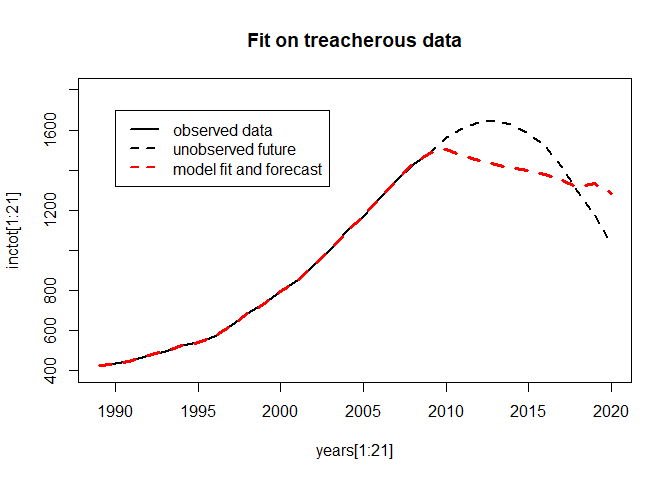
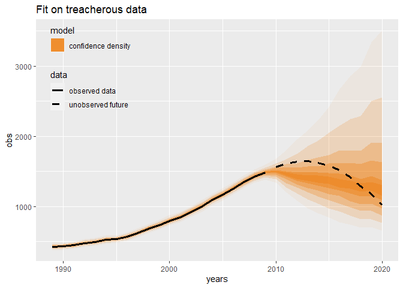

<!-- README.md is generated from README.Rmd. Please edit that file -->

# multiAPCMC v0.1.0

<!-- badges: start -->

[](https://travis-ci.com/MaartenBijlsma/multiAPCMC)
<!-- badges: end -->

multiAPCMC is a package that allows the user to fit multiple
age-period-cohort multiple classification (MultiAPCMC) models and test
them against a ‘leave-future-out’ set. In short, the package helps you
investigate a large range of possible APC model specifications and helps
you determine which is the best one for forecasting the future.

Age-period-cohort (APC) models are models that seek to decompose
outcomes into parts that are associated with time since birth (age),
calendar time (period), and time of birth (cohort). This is [tricky
business](https://maartenbijlsma.com/2017/11/25/a-hot-topic-and-a-futile-quest-the-recent-discussion-on-age-period-cohort-analysis-february-17-2014/)
because age, period and cohort are linearly dependent; if exact age of a
person is known at a particular point in time, that person’s birth date
can be calculated. This results in a ‘linear dependency problem’; linear
models cannot find a unique solution for this decomposition, and will
either give an error or they will remove terms from the model by fiat.
Nevertheless, APC scholars try to find solutions that result in
‘meaningful’ APC estimates. This is done by putting some constraint on
the model. Whether this is actually possible to do in a meaningful way
is up for debate. Personally, I remain skeptical of this idea, despite
this topic being recurrent in my work for more than a decade now. See
the commentaries in the [December 2013 issue of
Demography](https://link.springer.com/journal/13524/volumes-and-issues/50-6?page=1)
for a detailed discussion. However, this is only really relevant when we
want to give a substantive interpretation to, for example, cohort
trends. Do some birth cohorts have a higher risk of some outcome
(e.g. lung cancer) because they performed some activity (e.g. smoking)
during their lifetimes, relative to other birth cohorts (conditional on
age and calendar time)? We do statistics for a variety of reasons;
description, prediction, and causal explanation are the big three.
Perhaps APC models are still useful for predicting future trends
(forecasting)?

APC models are indeed also used for forecasting. This is where the
multiAPCMC package comes in. If some cohorts indeed have a higher risk
of (e.g.) lung cancer, then this would be useful information to know
when making age-specific forecasts of future cancer incidence. With this
idea in mind the [Nordpred
software](https://www.kreftregisteret.no/en/Research/Projects/Nordpred/Nordpred-software/)
was developed by the Cancer Registry (Kreftregisteret) of Norway. This
package fits APC models where age, period, and cohort are entered into a
generalized linear model as categorical variables, and a continuous time
trend referred to as ‘drift’ is also determined. In order for the model
to find a unique solution, a constraint has to be placed on the model.
The Nordpred software automatically does this by setting a second
reference category on the period and cohort dimensions. Specifically, it
sets the coefficient of both the first and last period in the time
series to be equal (i.e. have the same ‘effect’), and the coefficient of
the oldest and youngest birth cohort. However, this choice determines
the drift parameter, and thereby it has a potentially strong effect on
extrapolating the trend towards the future (forecasting).

In the multiAPCMC package, I allow the user to investigate other
constraints as well. We could instead set the middle periods or middle
cohorts to be equal (perhaps adjacent periods or cohorts are more
similar…?), or the first and the middle, and so forth. Other choices
that can be investigated are the link function (log link or power5 link)
and the number of periods to use for forecasting. The multiAPCMC package
also allows any data resolution, as long as they are in Lexis squares (1
year age by 1 year period, 2 year age by 2 year period, … 5 year age by
5 year period, etc.).

Below I provide a demonstration of the use of this package, which comes
with mock data.

## Installation

You can install the development version of multiAPCMC like so:

``` r
# Will later add here how to install the package.
```

## Example

``` r
source('R/getmode.R')
source('R/multiAPCMC.multifit.R')
source('R/multiAPCMC.reclist.R')
source('R/multiAPCMC.datashape.R')
source('R/multiAPCMC.singlefit.R')
source('R/multiAPCMC.multipred.R')
source('R/multiAPCMC.singlepred.R')
source('R/multiAPCMC.multipredtest.R')
source('R/multiAPCMC.ranktable.R')
source('R/multiAPCMC.retrievemodel.R')
source('R/multiAPCMC.randpred.R')
source('R/multiAPCMC.predsummary.R')
```

Let’s start by extracting one of the mock datasets and examining it. The
data has the following columns: - Age is the age in years (but could
also be 5-year age group or so) - Period is calendar time in years (but
could also be 5-year period categories) - cases are the incidence of
some outcome (e.g. cancer diagnosis or mortality) - PY stands for
person-years at risk in that year and age category

Notice that ‘cohort’ is not included. The software will construct this
as C = P - A automatically. Notice also that the data is in long format!
In Nordpred the data is in a matrix resembling a Lexis diagram. That is
not the case here.

``` r
data(multiAPCMC.example.data)

head(multiAPCMC.example.data)
#>   Age Period  PY cases
#> 1   0   1989 119     1
#> 2   1   1989  93     1
#> 3   2   1989  77     1
#> 4   3   1989  80     2
#> 5   4   1989  78     2
#> 6   5   1989 105     3

# it has the following age and period categories
unique(multiAPCMC.example.data$Age)
#>  [1]  0  1  2  3  4  5  6  7  8  9 10 11 12 13 14 15 16 17 18 19 20 21 22 23 24
#> [26] 25 26 27 28 29 30 31 32 33 34 35 36 37 38 39 40 41 42 43 44 45 46 47 48 49
#> [51] 50 51 52 53 54 55 56 57 58 59 60 61 62 63 64 65 66 67 68 69 70 71 72 73 74
#> [76] 75 76 77 78 79 80 81 82 83 84
unique(multiAPCMC.example.data$Period)
#>  [1] 1989 1990 1991 1992 1993 1994 1995 1996 1997 1998 1999 2000 2001 2002 2003
#> [16] 2004 2005 2006 2007 2008 2009
```

Multiple classification models deal poorly with structural 0s. Since
incidences tend to be low for low ages, we could investigate at which
age group we start having counts above 0. The code below shows that it
is actually already really OK at young ages, since even at age 0 there
are no 0s. But if there are, set startestage at some age category where
you don’t see that many 0s. For now, we will act as if that is age 29.
Note that ages below ‘startestage’ are not thrown out. The package still
uses information from those ages by taking the mean over period time for
that age category. It just does not use it in the statistical model.
Note also that we here set startestage to 30 because we have single year
age groups and we start counting at 0, so age 0 is ‘1’, age 1 is ‘2’,
and so forth. If we have 5-year age groups then 1 is age group ‘0 to 4’,
2 is age group ‘5 to 9’, and so forth.

``` r
multiAPCMC.example.data$cases[multiAPCMC.example.data$Age==0]
#>  [1] 1 1 1 1 1 1 1 1 1 1 1 1 1 1 1 1 1 1 1 1 1
multiAPCMC.example.data$cases[multiAPCMC.example.data$Age==1]
#>  [1] 1 1 1 1 1 1 1 1 1 1 1 1 1 1 1 1 1 1 1 1 1
multiAPCMC.example.data$cases[multiAPCMC.example.data$Age==2]
#>  [1] 1 2 2 2 2 1 1 1 1 1 1 1 1 1 1 1 1 1 1 1 1
multiAPCMC.example.data$cases[multiAPCMC.example.data$Age==4]
#>  [1] 2 2 2 2 2 2 2 2 2 2 2 2 1 2 2 2 2 2 1 2 2
multiAPCMC.example.data$cases[multiAPCMC.example.data$Age==6]
#>  [1] 3 3 3 3 3 3 3 2 2 3 2 2 3 2 2 2 2 2 2 2 2
multiAPCMC.example.data$cases[multiAPCMC.example.data$Age==8]
#>  [1] 4 4 4 5 4 3 3 4 3 4 4 3 3 3 3 3 3 3 3 3 3
multiAPCMC.example.data$cases[multiAPCMC.example.data$Age==20]
#>  [1]  7  8  7  8  9 11 10 11 14 14 17 15 18 18 20 21 18 18 21 18 18
multiAPCMC.example.data$cases[multiAPCMC.example.data$Age==30]
#>  [1]  4  4  5  6  7  8  8  9 11 13 18 20 21 25 31 36 33 42 44 48 48

startestage <- 30
```

Now we have to decide which model parameters we want to investigate. We
want to look at both link functions (natural log and power5), and let’s
look at a large range of periods (take only 5 years into account, 10
years, 15 years, and 21 years). For period and cohort constraints, let’s
look at all possible constraints. We then put these parameters in the
multiAPCMC.multifit() function and it will fit all these models. The
parameter ‘nomodelmax’ ensures that we can’t possibly fit more than 1024
models. That is not a concern here; the function tells us that it is
fitting 392 models.

``` r
vec.link <- c('power5','log')
vec.noperiod <- c(5,10,15,21)
vec.refper <- c('extremes','outer','center', 'first middle','middle last',
                'first second', 'penultimate last')
vec.refcoh <- c('extremes','outer','center', 'first middle','middle last',
                'first second', 'penultimate last')

fitlist <- multiAPCMC.multifit(data=multiAPCMC.example.data,
                               startestage=startestage,
                               vec.link=vec.link,
                               vec.noperiod=vec.noperiod,
                               vec.refper=vec.refper,
                               vec.refcoh=vec.refcoh,
                               nomodelmax=1024)
#> [1] "fitting 392 APCMC models"
```

We saved the output from the multiAPCMC.multifit() function in the
object ‘fitlist’. This object now contains the output of 392 models! I
wouldn’t recommend opening it unless you have to. Some other functions
will help when interacting with this object.

First, let’s make predictions for each of those models. That way we can
subsequently check how good the predictions of these models are. To do
that, we need to have an object that contains the personyears (PY) for
future age and period categories. The age categories will be the same in
the future, but of course the calendar years will, by definition, have
increased.

Future person-years could come from the (projected) estimates of
population size from a national statistics office. Or you could first
make your own projection of future population size by age category.

I load an artificial dataset called multiAPCMC.example.futuredata that
contains these future person-years. This dataset also has a column
‘cases’. This column can be ignored if you want to forecast future
incidence. In fact, you don’t need that column to be in the dataset at
all. However, if you also want to benchmark the best model, you need to
compare the observed cases with the forecasted cases. So we will use
that column later in this example.

Finally, we can also set a ‘cuttrend’ parameter; this is an attenuation
parameter that reduces the predictions by some factor. It was introduced
by Nordpred because predictions from a model with a log-link can
sometimes become explosive (since the inverse of log is exp), and this
holds that in check. I set it to 0 here, but it should be considered
when the drift (=overall trend) is strongly upwards.

For the forecast, we will use the multiAPCMC.multipred() function. This
function predicts the future following all of the 392 models!

``` r

data(multiAPCMC.example.futuredata)
head(multiAPCMC.example.futuredata)
#>      Age Period  PY cases
#> 1786   0   2010 281     1
#> 1787   1   2010 338     1
#> 1788   2   2010 273     1
#> 1789   3   2010 315     1
#> 1790   4   2010 284     1
#> 1791   5   2010 284     2

predlist <- multiAPCMC.multipred(multiAPCMC.multifit.object=fitlist,
                                 futuredata=multiAPCMC.example.futuredata,
                                 cuttrend=rep(0,15))
#> [1] "Projecting 11 periods into the future"
```

We save our predictions in an object called ‘predlist’. Since predlist
is also a very large object, I don’t suggest interacting directly with
it.

So which model is best? For that, we will use the
‘multiAPCMC.ranktable()’ function. This function compares the predicted
incidence following each model to the true incidence. In order to do
that, we need to fit our models to only a part of the time trend that we
have access to. For example, here we had data from 1989 to 2020. What we
then did was take the first 21 years (1989 to 2009) and use it as
‘training data’ and then use the last 11 years (2010 to 2020) and use it
as ‘validation data.’ We will get into the reasoning behind that a bit
later.

Here we compare the predicted incidence to true incidence using root
mean squared error (RMSE), but there are also other measures we can rank
by (they will still get calculated, but the list will be ranked by
RMSE). The object multiAPCMC.example.futuredata is placed as oos.data
(out of sample data). Out of sample refers to the ‘not part of the
sample that the models were trained on. The validate.what parameter asks
which part of the data to calculate RMSE for; the out of sample data
(data at the end of the time series), the out of sample data PLUS data
that we did not fit on that was at the beginning of the time series\*
referred to as ’not periodfitted’, or all the data including the data we
fitted on (not recommended). Generally, ‘out of sample’ (oos) is
recommended.

\*e.g. if we have 20 years of training data, but noperiod was 10, then
we have 10 years BEFORE the data used for fitting that we can also use,
since it wasn’t trained on that data.

We use the function ‘multiAPCMC.ranktable()’ function to do this. We
then look at the top 10 and bottom 10 models.

``` r
ranktable <- multiAPCMC.ranktable(multiAPCMC.multifit.object=fitlist,
                                     multiAPCMC.multipred.object=predlist,
                                     rankhow='RMSE',
                                     oos.data=multiAPCMC.example.futuredata,
                                     validate.what='oos')

# top 10 models
ranktable[1:10,]
#>       link noperiod   ref_period       ref_cohort refper1st refper2nd refcoh1st
#> 271 power5       21 first second      middle last      1989      1990      1942
#> 200    log       21 first middle     first middle      1989      1999      1905
#> 47  power5       21 first second         extremes      1989      1990      1905
#> 383 power5       21 first second penultimate last      1989      1990      1978
#> 199 power5       21 first middle     first middle      1989      1999      1905
#> 103 power5       21 first second            outer      1989      1990      1920
#> 159 power5       21 first second           center      1989      1990      1942
#> 144    log       21 first middle           center      1989      1999      1942
#> 215 power5       21 first second     first middle      1989      1990      1905
#> 143 power5       21 first middle           center      1989      1999      1942
#>     refcoh2nd   is.AIC oos.RMSE  oos.MAE     driftSE is.pcAIC
#> 271      1979 4871.718 10.63601 7.272608 0.009293222 231.9865
#> 200      1942 4870.818 10.63904 6.083363 0.020449196 231.9437
#> 47       1979 4871.718 10.69941 7.344174 0.009257565 231.9865
#> 383      1979 4871.718 10.74020 7.393888 0.026462803 231.9865
#> 199      1942 4871.718 10.74375 6.050796 0.002007164 231.9865
#> 103      1964 4871.718 10.83663 7.504271 0.009276391 231.9865
#> 159      1943 4871.718 10.88075 7.552100 0.016417565 231.9865
#> 144      1943 4870.818 10.89248 6.242397 0.145593912 231.9437
#> 215      1942 4871.718 10.95834 7.628858 0.009334571 231.9865
#> 143      1943 4871.718 10.96371 6.178769 0.013592732 231.9865

# bottom 10 models
ranktable[382:392,]
#>       link noperiod       ref_period   ref_cohort refper1st refper2nd refcoh1st
#> 287 power5       21         extremes first second      1989      2009      1905
#> 335 power5       21 penultimate last first second      2008      2009      1905
#> 295 power5       21            outer first second      1993      2005      1905
#> 319 power5       21      middle last first second      1999      2009      1905
#> 303 power5       21           center first second      1999      2000      1905
#> 312    log       21     first middle first second      1989      1999      1905
#> 288    log       21         extremes first second      1989      2009      1905
#> 336    log       21 penultimate last first second      2008      2009      1905
#> 296    log       21            outer first second      1993      2005      1905
#> 320    log       21      middle last first second      1999      2009      1905
#> 304    log       21           center first second      1999      2000      1905
#>     refcoh2nd   is.AIC  oos.RMSE  oos.MAE    driftSE is.pcAIC
#> 287      1906 4871.718  56.48612 18.07523 0.08070446 231.9865
#> 335      1906 4871.718  59.69235 19.44145 0.08089258 231.9865
#> 295      1906 4871.718  61.62920 20.27118 0.08072123 231.9865
#> 319      1906 4871.718  65.14817 21.77967 0.08072172 231.9865
#> 303      1906 4871.718  66.41038 22.32152 0.08102011 231.9865
#> 312      1906 4870.818 148.16090 29.80172 0.81909910 231.9437
#> 288      1906 4870.818 185.93321 37.56023 0.81918867 231.9437
#> 336      1906 4870.818 201.63499 40.76817 0.82050973 231.9437
#> 296      1906 4870.818 216.02402 43.68581 0.81931624 231.9437
#> 320      1906 4870.818 233.38559 47.18543 0.81932165 231.9437
#> 304      1906 4870.818 247.64066 50.04088 0.82194520 231.9437
```

In this case, the top 10 models are all quite close together, as they
have RMSE scores that are very similar. With real data, and depending on
the constraints chosen, this does not have to be the case. We see that
the model with a power5 link, 21 periods of fit, first-second for period
references and extremes for cohort references, is the top model.

Note that AIC, pAIC, and driftSE are straight from the models fitted on
the training data. They are not determined on the validation data.

Look at the bottom 10 models and note that the RMSE of the worst models
is a lot worse than the RMSE of the best models.

Models fitted following ‘Nordpred’ specifications would have ‘extremes’
as both period refs and cohort refs.

Let’s look at the data and the best model, plus its forecast. For this,
we need to extract the predictions of the best model from the giant
model object. It would be a lot of work to find this object, so we have
the multiAPCMC.retrievemodel() function. In this function, we can just
enter the parameters of the best model from ranktable. There are two
ways to do this. Either to enter those parameters manually, or to take
the elements of the first row of the ranktable. I demonstrate both:

``` r

# Manually:
rank1mod <- multiAPCMC.retrievemodel(multiAPCMC.multipred.object=predlist,
                                     what="pred",
                                     link='log',
                                     noperiod=15,
                                     refper='first second',
                                     refcoh='extremes')

# Elements of the first row of ranktable:
rank1par <- ranktable[1,1:4]
rank1mod <- multiAPCMC.retrievemodel(multiAPCMC.multipred.object=predlist,
                                     what="pred",
                                     link=rank1par[1],
                                     noperiod=rank1par[2],
                                     refper=rank1par[3],
                                     refcoh=rank1par[4])
# either way, we now have the model predictions in rank1mod

head(rank1mod)
#>   Age Cohort Period cases observed periodfitted        rate   rate_high
#> 1   0   1989   1989     1        1            1 0.008403361 0.008403361
#> 2   1   1988   1989     1        1            1 0.010752688 0.010752688
#> 3   2   1987   1989     1        1            1 0.012987013 0.012987013
#> 4   3   1986   1989     2        1            1 0.025000000 0.025000000
#> 5   4   1985   1989     2        1            1 0.025641026 0.025641026
#> 6   5   1984   1989     3        1            1 0.028571429 0.028571429
#>      rate_low  PY pred_cases pred_cases_low pred_cases_high or.Per or.Age
#> 1 0.008403361 119          1              1               1   1989      0
#> 2 0.010752688  93          1              1               1   1989      1
#> 3 0.012987013  77          1              1               1   1989      2
#> 4 0.025000000  80          2              2               2   1989      3
#> 5 0.025641026  78          2              2               2   1989      4
#> 6 0.028571429 105          3              3               3   1989      5
```

Note that Age, Cohort and Period columns in the rank1mod object are
recoded and have the earlier-mentioned constraints imposed on them. So
don’t interact with those. If you want to interact with the original Age
or Period categories, use the or.Age and or.Per columns.

Let’s make a plot with the original data first. Let’s just look by year,
so we add all the incidences in a year together, summing over the age
groups.

To get the same information from our best model’s prediction, we can use
the function multiAPCMC.predsummary(). We just tell it which years we
want a summary from, and which model.

``` r

# first, let's plot the real (observed) values
alldat <- rbind(multiAPCMC.example.data,multiAPCMC.example.futuredata)
inctot <- NULL
years <- sort(unique(alldat$Period))
for(k in 1:length(years)) {
  inctot[k] <- sum(alldat$cases[alldat$Period==years[k]])
}
plot(years[1:21],inctot[1:21],type='l', lwd=2,
     xlim=c(1989,2020),
     ylim=c(400,1800),
     main='Fit on treacherous data')
lines(years[21:32],inctot[21:32],lty=2, lwd=2)

inctot.mod <- multiAPCMC.predsummary(years,rank1mod)
lines(years,inctot.mod$pred, col='red', lty=2,lwd=3)

legend(1990,1700,
       legend=c('observed data',
                'unobserved future',
                'model fit and forecast'),
       lty=c(1,2,2),
       lwd=2,
       col=c('black','black','red'))
```



We see that our model fits really well for the training period. This
makes sense, our model was fitted on 21 years of the data (the training
data), and since it has Period as a factor variable, the model fits
period-time exactly right.

However, the subsequent years (2010+) our model somewhat underpredicts
initially. However, the data I fed it was rather terrible: we usually
assume that the current trend will continue onwards. But I purposely put
a declining trend into the data. Despite this, our best model
understands that a decline is happening despite an initial trend
upwards. So this is actually a surprisingly good fit.

Note that the curve we see here is rather treacherous: most trends will
not look like this empirically speaking. So I think we model does
decently.

Note that if a noperiod was chosen that was less than the total training
data, then the data from calendartime -before- the training data can
also be mispredicted.

But this is a bit of an ugly plot! And it also doesn’t include
uncertainty in our estimates. Any self-respecting forecast should
include uncertainty. After all, forecasting is an inherently
probabilistic exercise.

How do we get forecast uncertainty? Since I will need to aggregate over
categories, and I cannot just sum lower bounds or sum upper bounds from
the ‘rank1mod’ object. Instead, I need to get the original model first:
for this, I use multiAPCMC.retrievemodel() again, but now with ‘what’
set to ‘fit’ instead of ‘pred’. I save this in the ‘fitrank1mod’ object.

With this object, I can do a parametric bootstrap. This means I will
create many predictions; each one will be a random draw from the
so-called ‘estimator distribution’ of the model. This is very similar to
taking draws from a posterior distribution in Bayesian estimation (see
e.g. Gelman ‘Regression and other stories’) or McElreath (‘Statistical
Rethinking’).

What I will do is I will draw from this distribution, and then
immediately summarize the incidences using multiAPCMC.predsummary(), and
then save that into an object called ‘bsdat’.

The parameter poissondraw makes the process even more probabilistic: not
only do we predict the mean and its standard error, but also we take
into account that count variables follow a poisson distribution. With
poissondraw=FALSE this helps produce confidence intervals. With
poissondraw=TRUE it creates prediction intervals. With the large numbers
that we have here, the prediction interval is only a fraction larger.

``` r
fitrank1mod <- multiAPCMC.retrievemodel(fitlist,
                                        what="fit",
                                        link=rank1par[1],
                                        noperiod=rank1par[2],
                                        refper=rank1par[3],
                                        refcoh=rank1par[4])

# let's draw 499 many times and save the quantiles
bssize <- 499
bsdat <- multiAPCMC.predsummary(years,multiAPCMC.randpred(multiAPCMC.singlefit.object=fitrank1mod,
                                                          futuredata=multiAPCMC.example.futuredata,
                                                          noproj=11,
                                                          cuttrend=rep(0,11)),
                                poissondraw=TRUE)
for(b in 1:bssize) {

  bsdat <- rbind(bsdat,multiAPCMC.predsummary(years,multiAPCMC.randpred(fitrank1mod,
                                                                        futuredata=multiAPCMC.example.futuredata,
                                                                        noproj=11,
                                                                        cuttrend=rep(0,11)),
                                                                        poissondraw=TRUE))
}

# from this, let's store some quantiles (this can probably be done in a
# more efficient way!)
predtable <- multiAPCMC.predsummary(years,rank1mod)
predtable$pred_025 <- NA
predtable$pred_975 <- NA
predtable$pred_100 <- NA
predtable$pred_900 <- NA
predtable$pred_800 <- NA
predtable$pred_200 <- NA
predtable$pred_700 <- NA
predtable$pred_300 <- NA
predtable$pred_400 <- NA
predtable$pred_600 <- NA
predtable$pred_450 <- NA
predtable$pred_550 <- NA

for(y in sort(unique(predtable$years))) {

  qs <- quantile(bsdat$pred[bsdat$years==y],probs=c(0.025,0.975,0.10,0.90,0.20,0.80,0.30,0.70,0.40,0.60,0.45,0.55))
  predtable$pred_025[predtable$years==y] <- qs[1]
  predtable$pred_975[predtable$years==y] <- qs[2]

  predtable$pred_100[predtable$years==y] <- qs[3]
  predtable$pred_900[predtable$years==y] <- qs[4]

  predtable$pred_800[predtable$years==y] <- qs[5]
  predtable$pred_200[predtable$years==y] <- qs[6]

  predtable$pred_700[predtable$years==y] <- qs[7]
  predtable$pred_300[predtable$years==y] <- qs[8]

  predtable$pred_400[predtable$years==y] <- qs[9]
  predtable$pred_600[predtable$years==y] <- qs[10]

  predtable$pred_450[predtable$years==y] <- qs[11]
  predtable$pred_550[predtable$years==y] <- qs[12]

}
predtable$obs <- c(inctot[1:21],rep(NA,length(22:32)))
predtable$future <- c(rep(NA,length(1:21)),inctot[22:32])

# we need ggplot for this
library(ggplot2)

# lets make the transparency reflect the certainty level
# but in a cumulative way
prea <- c(0.05,0.20,0.40,0.60,0.80,0.90)
a <- prea - c(0,prea[-length(prea)])*0.75 
# the  0.75 is an inverse amplification value; lower it for stronger colors

# plot with confidence levels
p <- ggplot(predtable,aes(years))
p +
  geom_ribbon(aes(ymin=pred_025,ymax=pred_975, fill='confidence density'),alpha=a[1]) +
  geom_ribbon(aes(ymin=pred_100,ymax=pred_900, fill='confidence density'), alpha=a[2]) +
  geom_ribbon(aes(ymin=pred_200,ymax=pred_800, fill='confidence density'), alpha=a[3]) +
  geom_ribbon(aes(ymin=pred_300,ymax=pred_700, fill='confidence density'), alpha=a[4]) +
  geom_ribbon(aes(ymin=pred_400,ymax=pred_600, fill='confidence density'), alpha=a[5]) +
  geom_ribbon(aes(ymin=pred_450,ymax=pred_550, fill='confidence density'), alpha=a[6]) +
  geom_line(aes(y=obs,colour='observed data', linetype='observed data'),size=1.2) +
  geom_line(aes(y=future,colour="unobserved future", linetype='unobserved future'),size=1.2) +
  ggtitle("Fit on treacherous data") +
  scale_color_manual(name = "data", values = c("observed data" = "black",
                                                   "unobserved future" = "black")) +
  scale_fill_manual(name='model', values = c("confidence density" = "darkorange2")) +
  scale_linetype_manual(name='data',values=c("observed data" = "solid",
                                             "unobserved future" = "dashed")) +
  theme(legend.position = c(0.15, 0.8),
        legend.background=element_blank())
#> Warning: Removed 11 row(s) containing missing values (geom_path).
#> Warning: Removed 21 row(s) containing missing values (geom_path).
```



``` r
# using alpha allows for layered colours
```

There are various papers out there on why ‘leave-future-out’ validation
might be a good idea. One reason is that it simply allows us to see how
our model behaves compared to the truth.

Another reason is that forecasting models have an implicit assumption
that some component of the current or past will continue in the future
(why else use data to predict the future?). Usually, that component is
the current trend. By using leave-future-out validation, we can actually
see which APC model creates the line that best fits the ‘current trend’
(the trend of the leave-future-out period). This is not normally clear
in APCMC models because the period factors cause a near-perfect fit to
the training data.

Hence, our assumption could be either: \* (1) we continue extrapolating
this trend to the future that we don’t have data on yet. after all, we
started out believing that the future is best predicted by extrapolating
the current trend. So we are very transparent in our assumptions. \*
(2), we believe that the parameters that were used to fit this model on
the training data are also the best parameters for fitting to the full
data. So we re-fit the APC model to the complete data using these
parameters, and then forecast into the unknown future.

If we have a ‘training set’ and a ‘validation set’, what do we then do
when we have decided what the best model parameters are? Do we then use
the full set? One idea is a combination of (1) and (2). Namely, we could
use the full dataset from (2), but we use the cohort and period
references from (1). If we want to do this, we cannot use
multiAPCMC.retrievemodel() because it refers to cohorts and periods by
“extremes” or “middle”. However, what is “extreme” or what is “middle”
will change when we add years to the dataset. Instead, we can use
multiAPCMC.datashape() and multiAPCMC.singlefit. These functions allow
us to refer to the exact cohort and period references. I show this
below:

``` final

ranktable$refper1st[1]
ranktable$refper2nd[1]
ranktable$refcoh1st[1]
ranktable$refcoh2nd[1]

rank1ds <- multiAPCMC.datashape(alldat,
                                noperiod=21,
                                startestage=startestage,
                                refper1st="1989",
                                refper2nd="1990",
                                refcoh1st="1942",
                                refcoh2nd="1979")
fitrank1mod2 <- multiAPCMC.singlefit(rank1ds,link="power5")

# or, alternatively:

rank1ds <- multiAPCMC.datashape(alldat,
                                  noperiod=ranktable$noperiod[1],
                                  startestage=startestage,
                                  refper1st=ranktable$refper1st[1],
                                  refper2nd=ranktable$refper2nd[1],
                                  refcoh1st=ranktable$refcoh1st[1],
                                  refcoh2nd=ranktable$refcoh2nd[1])
fitrank1mod2 <- multiAPCMC.singlefit(rank1ds,link=ranktable$link[1])
```
